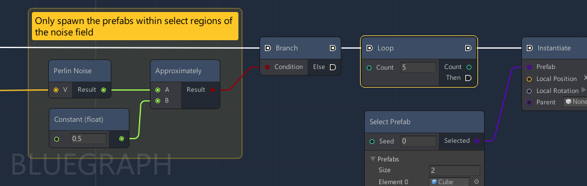

# BlueGraph

A generic visual scripting framework built on top of Unity's experimental GraphView components. Heavily inspired by [xNode](https://github.com/Siccity/xNode) and UE4's Blueprints. 




## Work in Progress

The master branch is unstable and API still in active development.

If you are still interested for trying it for yourself, feel free to provide feedback. 

Documentation is coming... eventually...


## Features

* Node-based visual editor built on top of Unity's modern UI framework
* Simple node development process through C# attributes on fields 
* Modularization of nodes and grouping related nodes into searchable subcategories
* Easily extendable for different use cases


## Requirements

Requires Unity version 2019.3 or above. 

>The framework makes use of Unity's [[SerializeReference]](https://docs.unity3d.com/ScriptReference/SerializeReference.html) attribute for native polymorphic serialization support introduced in 2019.3.


# Installing with Unity Package Manager

To install this project as a Git dependency using the Unity Package Manager, add the following line to your project's manifest.json:

```
"com.github.mcmanning.bluegraph": "https://github.com/McManning/BlueGraph.git"
```


# Samples

The core framework is built to be lightweight and support different workflows and requirements for projects that require a node-based editor. 

The package samples contains various use cases and more complex implementations that you can use as a starter for your own project.

## Basic


Examples showing the basic features of BlueGraph and different strategies for implementing different types of nodes for your own project.

## Advanced

Examples of how to add UE4 Blueprints style flow control to graphs via a custom execution port. 

## Subgraph

Example of creating a subgraph asset with specific IO ports (as defined by IO nodes within the graph) and executing that subgraph from within another graph asset.

*Requires the Advanced sample to be imported alongside it*
